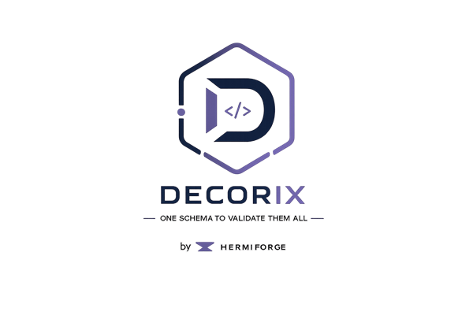

# @hermiforge-decorix/vue-vee-validate



VeeValidate adapter for Decorix metadata. It generates initial values, fields, and a validation schema backed by a Decorix validator.

> Full usage guide: [`docs/`](https://github.com/hermiforge/decorix/blob/main/docs/README.md) (narrative walkthrough beyond this package's API reference).

## Install

```sh
pnpm add @hermiforge-decorix/core @hermiforge-decorix/vue-vee-validate vue vee-validate
```

Peer dependencies: `vue@3.5.39`, `vee-validate@4.15.1`. `@hermiforge-decorix/zod` is only needed if you opt into Zod-backed validation — see Validator Notes below.

## Decorated Class

```ts
import {Email, Label, MinLength, Model, Required} from '@hermiforge-decorix/core';
import {toVeeValidate} from '@hermiforge-decorix/vue-vee-validate';

@Model('SignupDto')
class SignupDto {
  @Required('Name is required')
  @MinLength(2, 'Name is too short')
  @Label('Name')
  name!: string;

  @Required('Email is required')
  @Email('Invalid email')
  email!: string;
}

const config = toVeeValidate(SignupDto, {
  initialValues: {name: 'Ada'}
});

// `validationSchema` is a plain per-field function map — the generic shape
// vee-validate's `useForm`/`useField` recognize natively.
const {values, errors} = useForm({
  initialValues: config.initialValues,
  validationSchema: config.validationSchema
});

// Full-object validation (e.g. on submit) is still available directly:
const result = config.validate({name: 'Ada', email: 'ada@example.com'});
```

`T` is inferred straight from `SignupDto` — `config.initialValues` and `config.validate`/`validateAsync` are already typed, no separate form-values type or cast needed.

## Builder Model

```ts
import {model, stringField} from '@hermiforge-decorix/core';
import {createZodValidatorAdapter} from '@hermiforge-decorix/zod';
import {useVeeDecorix} from '@hermiforge-decorix/vue-vee-validate';

const SignupDto = model('SignupDto', {
  name: stringField().required('Name is required').minLength(2, 'Name is too short').label('Name'),
  email: stringField().required('Email is required').email('Invalid email')
});

const config = useVeeDecorix(SignupDto, {
  initialValues: {name: 'Ada'},
  validator: createZodValidatorAdapter()
});
```

## Validator Notes

`toVeeValidate` and `useVeeDecorix` create a runtime validation schema. When `options.validator` is omitted, they fall back to Decorix's core validator facade — no extra install needed. Pass an explicit adapter through `options.validator` (as in the Builder Model example above) only if you want a different engine, such as Zod via `createZodValidatorAdapter()`. `registerZodValidator()`'s global registration is **not** consulted here.

**Known limitation**: `validationSchema` validates each field independently by re-running Decorix validation against `initialValues` merged with the field under test. Cross-field constraints (e.g. `EqualsField`) are therefore best-effort at the field level — they see the last known snapshot of sibling fields, not their live values. For a fully accurate cross-field check, call `config.validate(values)` or `config.validateAsync(values)` with the complete current form values (e.g. on submit).


## License

LGPL-3.0-or-later — see the [repository LICENSE](https://github.com/hermiforge/decorix/blob/main/LICENSE).
